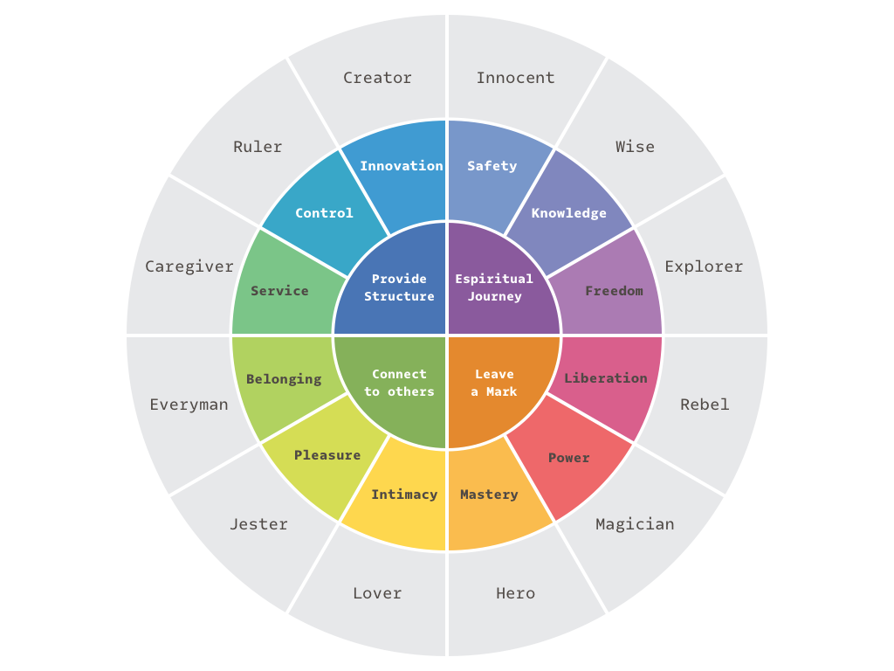

# Distribution

Distribution fortunately or unfortunately has become an integral part of any startup's pitch and strategy. VCs expect that a startup's series A pitch or even seed will have a distribution strategy. From what I have learned from talking to marketers at large and small companies is not much, but it gives me confidence that any team with discipline and solid execution can become their own marketers without hiring an internal or relying on an external expert. 

I want to talk about two things below:

1. Branding
2. Marketing

Not only the high level, but what low level activities these should impact.

## Branding

Take all this with a grain of salt - I've heard one talk on this, nothing more, but it really resonated with me.

There are two important things to know about branding:

1. Branding is about being **authentic**. 
2. Branding is the first step to effective marketing

It's finding out about the company you are and acting true to that brand - not mixing your messaging. You'll want to find one that jives. The most important thing about the brand is that it authentically reflects your company and team.  

There are many ways to settle on that brand. The one that I have learned is called archetypal branding. 

### Archetypal Branding

This is just one tool to describe who your company is. In archetypal branding you relate your company to one of 12 story archetypes:

There is some backing to this way of creating a brand (some limbic system justifications). I like it because I like stories.

---

Once you settle on one or two of the archetypes you have the kernel of your company's brand, and the next step is to expound on it.

### Unfurling the Kernel of your Brand

Now that you have settled on one or two archetypes that best represent your team and company, you can use those to impact real world decisions about your company. The tone/feeling of the content and the creative should be derived from your archetype.

Take your archetype: the magician and the creator let's say. And use that to brainstorm different images and words. You'll need to blend in a bit of the industry lingo into it, but that will be your starting point. You should now dip your website, landing pages, creative, tone of your interviews, in this archetypal soup to ensure that you have a consistent messaging throughout. 

---

You can of course tailor your messaging to different behaviors, but straying outside that voice will make your brand and company less authentic. 

